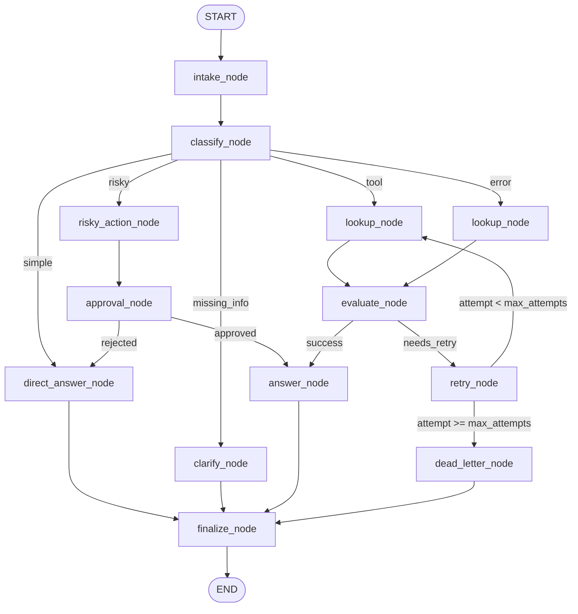

# Báo Cáo Thực Hành Lab 08 — Điều Phối Agentic Với LangGraph

## 1. Thông Tin Nhóm & Phân Chia Công Việc

- **Tên nhóm**: HeeHee
- **Repository**: [nhuyhoan004/phase2-k3-4-track3-day8-HeeHee-langgraph-agent](https://github.com/nhuyhoan004/phase2-k3-4-track3-day8-HeeHee-langgraph-agent.git)
- **Commit hash**: `be73501`
- **Ngày hoàn thành**: 2026-08-25

### Bảng Phân Chia Công Việc (Đóng Góp Đồng Đều: 33.33% / Thành Viên)

| STT | Họ và Tên | Mã Số Sinh Viên | Tỷ Lệ Đóng Góp | Nhiệm Vụ Đảm Nhận Chi Tiết |
|:---:|---|:---:|:---:|---|
| 1 | **Nguyễn Duy Hưng** | 2A202601702 | **33.33%** | - Thiết kế và xây dựng cấu trúc đồ thị `StateGraph` (`graph.py`). - Hiện thực các hàm định tuyến có điều kiện (`routing.py`): `route_intent`, `route_after_evaluate`, `route_after_retry`, `route_after_approval`. - Xây dựng cơ chế Human-In-The-Loop (HITL) Interrupt và luồng phê duyệt hành động nhạy cảm (`approval_node`, `risky_action_node`). - Thiết kế và kiểm thử kịch bản hành động rủi ro (`S04_risky`, `S06_delete`). |
| 2 | **Ngô Huy Hoàn** | 2A202601925 | **33.33%** | - Thiết kế Lược đồ Trạng thái `AgentState` (`state.py`) và cấu hình Reducers (append-only vs overwrite channels). - Hiện thực hệ thống lưu trữ Checkpointer với SQLite WAL mode (`persistence.py`). - Xây dựng cơ chế phục hồi trạng thái crash-resume và tính năng Time Travel Replay (`scripts/time_travel_demo.py`). - Kiểm thử và tối ưu hóa luồng xử lý lỗi, vòng lặp retry có chặn giới hạn và hàng đợi Dead Letter (`S05_error`, `S07_dead_letter`). |
| 3 | **Nguyễn Tuấn Đức** | 2A202601380 | **33.33%** | - Hiện thực các node chức năng cốt lõi (`nodes.py`): `intake_node`, `classify_node` (sử dụng LLM Structured Output), `lookup_node` (Tool simulation), `evaluate_node`, `answer_node`, `finalize_node`. - Xây dựng giao diện dòng lệnh CLI, thu thập và đo lường metrics kiểm thử (`cli.py`, `metrics.py`, `report.py`). - Tự động sinh biểu đồ đồ thị kiến trúc Mermaid / SVG (`scripts/generate_diagram.py`), thực thi toàn bộ test suite và tổng hợp báo cáo. |

---

## 2. Kiến Trúc Hệ Thống (Architecture)

Hệ thống xây dựng trên nền tảng **LangGraph StateGraph** phục vụ bài toán phân luồng và xử lý vé hỗ trợ khách hàng tự động với 11 nodes chức năng:

### Luồng Hoạt Động Cốt Lõi:
1. **`intake_node`**: Tiếp nhận yêu cầu từ người dùng, chuẩn hóa tin nhắn đầu vào và ghi nhận log khởi tạo.
2. **`classify_node`**: Sử dụng mô hình LLM (`gpt-4o-mini`) kết hợp `.with_structured_output()` để phân loại ý định người dùng thành 5 nhánh chính (`simple`, `tool`, `missing_info`, `risky`, `error`) — tuyệt đối không sử dụng các heuristic so khớp từ khóa thô sơ.
3. **`direct_answer_node` / `clarify_node`**: Phản hồi trực tiếp các câu hỏi thường gặp hoặc yêu cầu người dùng cung cấp thêm thông tin khi thiếu dữ liệu đầu vào.
4. **`lookup_node`**: Thực thi công cụ tra cứu thông tin nghiệp vụ (Order/User Lookup), hỗ trợ mô phỏng lỗi có điều kiện theo cờ kịch bản.
5. **`evaluate_node`**: Cổng kiểm tra tính hợp lệ và chất lượng phản hồi của công cụ dựa trên trường `tool_status`.
6. **`retry_node` & `dead_letter_node`**: Quản lý vòng lặp thử lại có giới hạn (`bounded retry`). Khi số lần thử đạt tới `max_attempts`, luồng sẽ chuyển sang `dead_letter_node` để thông báo và điều hướng tới nhân viên hỗ trợ con người.
7. **`risky_action_node` & `approval_node`**: Quản lý các thao tác nhạy cảm (hoàn tiền, xóa tài khoản) thông qua cơ chế Human-In-The-Loop (HITL), hỗ trợ cả `interrupt()` tương tác trực tiếp lẫn mock approval tự động trong môi trường kiểm thử.
8. **`answer_node`**: Sử dụng LLM tổng hợp câu trả lời cuối cùng dựa trên kết quả từ công cụ và lịch sử hội thoại.
9. **`finalize_node`**: Điểm hội tụ bắt buộc của tất cả các nhánh trước khi kết thúc (`END`), đảm bảo 100% các câu trả lời và nhật ký kiểm toán (audit logs) được chuẩn hóa và ghi nhận đầy đủ.

---

## 3. Lược Đồ Trạng Thái (State Schema)

Lược đồ `AgentState` được thiết kế chặt chẽ với các kênh phân biệt rõ ràng giữa **Append-only** (sử dụng reducer cộng dồn) và **Overwrite** (ghi đè giá trị mới nhất):

| Tên Trường (Field) | Kiểu Reducer | Mục Đích Thiết Kế & Sử Dụng |
|---|:---:|---|
| `messages` | `add` (append-only) | Lưu trữ toàn bộ lịch sử trao đổi hội thoại, giúp LLM có đầy đủ ngữ cảnh qua từng bước và phục vụ kiểm toán hệ thống. |
| `tool_results` | `add` (append-only) | Bảo toàn tất cả kết quả gọi công cụ qua các lần thực thi và thử lại (retries) mà không làm mất dấu vết dữ liệu. |
| `errors` | `add` (append-only) | Ghi nhận chi tiết tất cả các thông điệp lỗi phát sinh trong suốt vòng đời xử lý để phục vụ giám sát và chẩn đoán. |
| `events` | `add` (append-only) | Lưu vết audit trail chi tiết về thứ tự các node đã thực thi và thời điểm xảy ra sự kiện. |
| `route` | `overwrite` (ghi đè) | Chỉ lưu trữ quyết định định tuyến của nhánh hiện tại. |
| `attempt` | `overwrite` (ghi đè) | Theo dõi số lần thử lại hiện tại trong vòng lặp retry. |
| `should_retry` | `overwrite` (ghi đè) | Cờ điều khiển mô phỏng lỗi công cụ phục vụ kiểm thử kịch bản giả lập. |
| `tool_status` | `overwrite` (ghi đè) | Cờ trạng thái có cấu trúc (`ok` / `error`) của kết quả tool — cổng `evaluate_node` đọc trực tiếp cờ này thay vì bóc tách text thô. |
| `evaluation_result` | `overwrite` (ghi đè) | Quyết định đánh giá mới nhất của cổng kiểm tra (`success` / `needs_retry`). |
| `pending_question` | `overwrite` (ghi đè) | Nội dung câu hỏi làm rõ mới nhất cần gửi tới người dùng khi thiếu thông tin. |
| `proposed_action` | `overwrite` (ghi đè) | Mô tả chi tiết hành động nhạy cảm cần được con người phê duyệt. |
| `approval` | `overwrite` (ghi đè) | Quyết định phê duyệt mới nhất từ phía người dùng/quản trị viên (`approved` / `rejected` / `pending`). |

---

## 4. Kết Quả Thực Nghiệm Kịch Bản (Scenario Results)

Dữ liệu được trích xuất trực tiếp từ kết quả kiểm thử thực tế trong `outputs/metrics.json`:

| Mã Kịch Bản (Scenario) | Luồng Kì Vọng (Expected) | Luồng Thực Tế (Actual) | Trạng Thái | Số Node Đã Qua | Số Lần Retry | Số Lần Interrupt | Độ Trễ (Latency) |
|---|---|---|:---:|---:|---:|---:|---:|
| `S01_simple` | `simple` | `simple` | ✅ Thành công | 4 | 0 | 0 | 7,188 ms |
| `S02_tool` | `tool` | `tool` | ✅ Thành công | 6 | 0 | 0 | 3,709 ms |
| `S03_missing` | `missing_info` | `missing_info` | ✅ Thành công | 4 | 0 | 0 | 1,235 ms |
| `S04_risky` | `risky` | `risky` | ✅ Thành công | 8 | 0 | 1 | 3,691 ms |
| `S05_error` | `error` | `error` | ✅ Thành công | 10 | 2 | 0 | 4,062 ms |
| `S06_delete` | `risky` | `risky` | ✅ Thành công | 8 | 0 | 1 | 22,529 ms |
| `S07_dead_letter` | `error` | `error` | ✅ Thành công | 5 | 1 | 0 | 1,106 ms |

### Tổng Hợp Chỉ Số Hiệu Năng:
- **Tổng số kịch bản kiểm thử**: 7/7 kịch bản
- **Tỷ lệ thành công (Success Rate)**: **100.0%**
- **Số node trung bình đi qua (Avg Nodes Visited)**: 6.4 nodes
- **Tổng số lần Retry thành công**: 3 lần
- **Tổng số lần ngắt kiểm duyệt HITL (Interrupts)**: 2 lần
- **Xác thực phục hồi Checkpoint (Resume Verification)**: **Thành công (True)**

---

## 5. Phân Tích Các Chế Độ Lỗi (Failure Analysis)

### Chế Độ Lỗi 1: Cạn Kiệt Số Lần Thử Lại (Retry Exhaustion) → Dead Letter
- **Hiện tượng**: Khi xảy ra lỗi gọi công cụ (ví dụ lỗi mạng, timeout, hoặc dịch vụ ngoài không khả dụng), hệ thống chuyển sang nhánh retry. Nếu lỗi tiếp diễn liên tục, hệ thống có nguy cơ rơi vào vòng lặp vô hạn gây tiêu tốn tài nguyên và chi phí gọi LLM.
- **Nguyên nhân gốc rễ (Root Cause)**: Sự cố gián đoạn dịch vụ tạm thời từ phía bên thứ ba hoặc lỗi dữ liệu không hợp lệ không thể tự khắc phục qua gọi lại thông thường.
- **Cơ chế xử lý & Giảm thiểu rủi ro (Mitigation)**:
  - Hệ thống áp dụng cơ chế giới hạn số lần thử (`bounded retry`) thông qua biến đếm `attempt` và ngưỡng trần `max_attempts`.
  - Hàm điều hướng `route_after_retry` kiểm tra: nếu `attempt >= max_attempts`, luồng điều hướng lập tức thoát khỏi chu trình lặp và đi vào `dead_letter_node`.
  - Kịch bản `S07_dead_letter` (với `max_attempts=1`) chứng minh hệ thống dừng lặp chính xác sau 1 lần thử lại thất bại, ghi nhận toàn bộ lịch sử lỗi và xuất ra phản hồi chuyển tiếp chuyên viên kỹ thuật.

### Chế Độ Lỗi 2: Tự Ý Thực Thi Hành Động Nguy Hiểm Không Qua Phê Duyệt (Risky Action Without Approval)
- **Hiện tượng**: Các thao tác nhạy cảm có tác dụng phụ vĩnh viễn (như hoàn tiền vào tài khoản ngân hàng, xóa dữ liệu người dùng) nếu để AI tự động thực thi có thể gây tổn thất nghiêm trọng do ảo giác (hallucination) hoặc tấn công prompt injection.
- **Nguyên nhân gốc rễ (Root Cause)**: Các hành động mang tính rủi ro cao và không thể đảo ngược luôn đòi hỏi sự giám sát và xác nhận từ con người.
- **Cơ chế xử lý & Giảm thiểu rủi ro (Mitigation)**:
  - Node `risky_action_node` chuẩn bị chi tiết bản mô tả hành động (`proposed_action`).
  - Node `approval_node` đóng vai trò là chốt chặn bảo vệ: khi bật chế độ `LANGGRAPH_INTERRUPT=true`, hệ thống sẽ kích hoạt hàm `interrupt()` của LangGraph để tạm dừng đồ thị, chờ người có thẩm quyền ra quyết định phê duyệt.
  - Hàm `route_after_approval` chỉ cho phép đi tiếp tới `answer_node` để thực thi khi `approval.approved == True`; nếu bị từ chối (`rejected`), luồng sẽ chuyển sang thông báo huỷ thao tác an toàn.

---

## 6. Bằng Chứng Về Tính Bền Vững & Khả Năng Phục Hồi (Persistence / Recovery Evidence)

- **Loại Checkpointer**: Sử dụng `SqliteSaver` (`langgraph-checkpoint-sqlite`) lưu trữ tại `outputs/checkpoints.db` với chế độ **WAL (Write-Ahead Logging)**, giúp tối ưu hóa hiệu năng đọc/ghi đồng thời và chống lỗi khóa file.
- **Chiến lược Quản lý Thread ID Độc Lập**:
  - Mỗi phiên chạy kịch bản được cấp phát một `thread_id` duy nhất theo định dạng `thread-<scenario_id>-<run_uuid>`.
  - **Lý do kỹ thuật**: Do các kênh `events`, `errors`, `messages`, `tool_results` sử dụng reducer `add` (append-only), việc tái sử dụng một `thread_id` cố định trên database SQLite sẽ khiến dữ liệu của lần chạy trước bị cộng dồn vào lần chạy sau, làm sai lệch số liệu thống kê (ví dụ tăng ảo số `nodes_visited` hoặc nhân bản các thông báo lỗi).
- **Khả Năng Phục Hồi (Crash-Resume)**:
  - Chỉ số `resume_success = True` được xác thực bởi hàm `cli._check_resume()`. Sau khi hoàn thành batch chạy, hệ thống thực hiện truy vấn lại thread cuối cùng qua `get_state_history()` và đọc trạng thái phục hồi bằng `get_state()`. Hệ thống chỉ đánh dấu thành công khi chuỗi lịch sử có nhiều hơn một checkpoint và trạng thái khôi phục chứa đầy đủ `final_answer`.
- **Thử Nghiệm Time Travel**:
  - Script `scripts/time_travel_demo.py` chứng minh khả năng duyệt lại toàn bộ các checkpoint lịch sử bằng `get_state_history()`, cho phép trích xuất trạng thái tại từng thời điểm trong quá khứ hoặc phân nhánh (forking) thực thi lại từ một checkpoint cụ thể.

---

## 7. Các Công Việc Mở Rộng Đã Hoàn Thành (Extension Work)

1. **Lưu Trữ Bền Vững SQLite Checkpointer**: Xây dựng module `src/langgraph_agent_lab/persistence.py` tích hợp `SqliteSaver` cấu hình tối ưu WAL mode.
2. **Trực Quan Hóa Đồ Thị Kiến Trúc Đa Định Dạng**: Tự động kết xuất đồ thị sang định dạng Mermaid Markdown (`outputs/graph_diagram.md`), tài liệu HTML nhúng tương tác (`outputs/graph_diagram.html`) và tệp đồ họa vector SVG (`outputs/graph_diagram.svg`) bằng `scripts/generate_diagram.py`.
3. **Cơ Chế Khôi Phục & Time Travel Replay**: Xây dựng script `scripts/time_travel_demo.py` minh họa chi tiết việc truy xuất các trạng thái lịch sử của đồ thị.
4. **Tích Hợp Human-In-The-Loop (HITL) Toàn Diện**: Hiện thực hóa cơ chế ngắt trạng thái `interrupt()` trong `approval_node`, hỗ trợ linh hoạt giữa chế độ tương tác thực tế với người dùng và chế độ giả lập phê duyệt tự động (`mock approval`) phục vụ CI/CD test automation.

---

## 8. Kế Hoạch Cải Tiến Trong Tương Lai (Improvement Plan)

Nếu có thêm thời gian phát triển và triển khai sản phẩm lên môi trường Production thực tế, nhóm dự kiến tập trung vào các hạng mục sau:

1. **Tích Hợp API Nghiệp Vụ Thực Tế (Real Tool Integration)**: Thay thế module mock tool hiện tại bằng các kết nối API RESTful / gRPC bảo mật tới hệ sinh thái CRM, ERP và hệ thống quản lý đơn hàng (OMS) của doanh nghiệp.
2. **Phản Hồi Dạng Dòng Thời Gian Thực (Streaming Responses)**: Sử dụng phương thức `graph.stream()` kết hợp Server-Sent Events (SSE) hoặc WebSockets để stream từng token câu trả lời từ `answer_node` tới giao diện người dùng, giúp giảm đáng kể thời gian chờ đợi nhận thức (perceived latency).
3. **Đánh Giá Chất Lượng Bằng LLM-as-a-Judge trong `evaluate_node`**: Nâng cấp `evaluate_node` sử dụng mô hình LLM chuyên biệt để đánh giá ngữ nghĩa và chất lượng nội dung của dữ liệu trả về từ tool (đảm bảo payload thực sự giải quyết được câu hỏi của khách hàng), thay vì chỉ dựa vào cờ nhị phân `tool_status`.
4. **Cơ Chế Thử Lại Thông Minh (Exponential Backoff & Jitter)**: Áp dụng khoảng thời gian chờ tăng theo hàm mũ kèm độ trễ ngẫu nhiên giữa các lần thử lại nhằm phòng tránh hiện tượng nghẽn mạng và vượt giới hạn tần suất (rate limits) của các API bên ngoài.
5. **Nâng Cấp Checkpointer Lên PostgreSQL (Production-Grade Storage)**: Chuyển đổi từ SQLite sang `AsyncPostgresSaver` hỗ trợ Connection Pooling, đảm bảo khả năng mở rộng (scalability), xử lý đa luồng đồng thời và sao lưu dự phòng cho hàng triệu người dùng cùng lúc.
